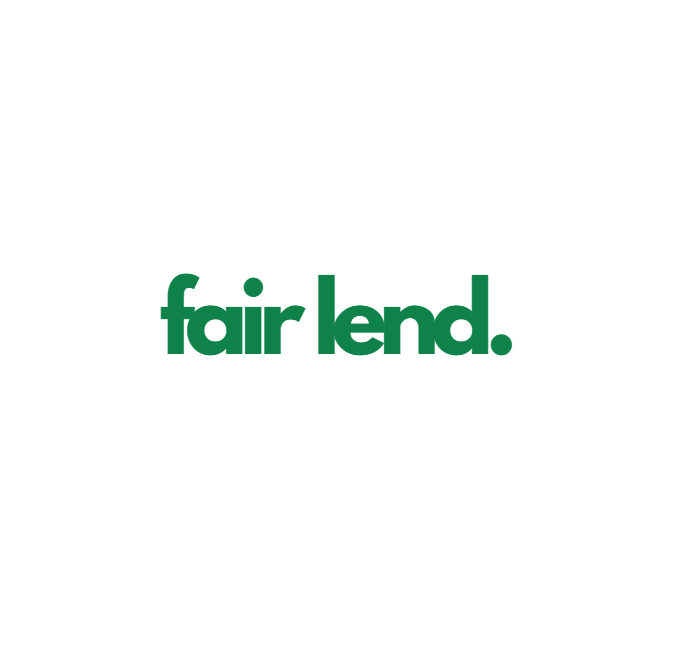
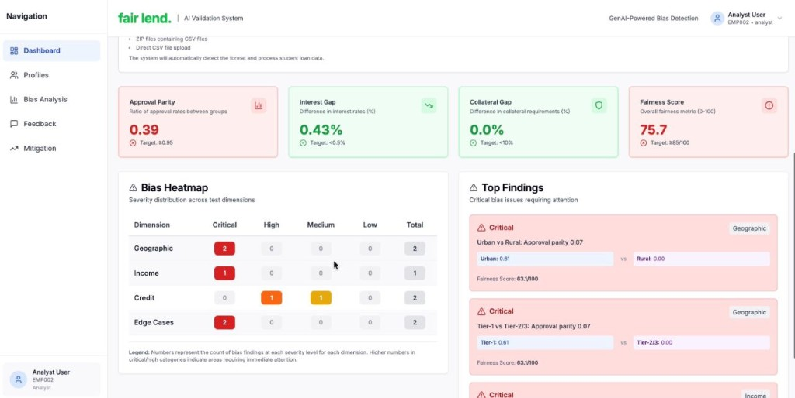
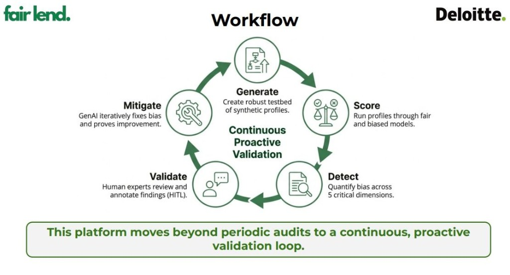
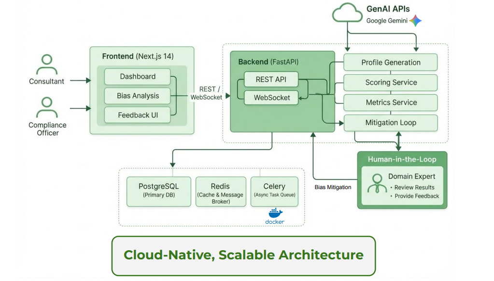

&nbsp;&nbsp;&nbsp;&nbsp;&nbsp;&nbsp;

  

# FairLend — AI Fair Lending Validation Workbench

### GenAI-powered, human-in-the-loop platform for detecting, quantifying, and mitigating bias in education loan AI systems

 

---

## Product Demo

**[▶ Click to Watch Full Demo Video](https://drive.google.com/file/d/1WEtUOMbM7xz_MNx5zw3YgwkWfablmjH-/preview)**

*Opens in Google Drive — plays directly in your browser, no download needed.*

---

## Overview

**FairLend** was built as part of a GenAI Capstone initiative in collaboration with **Deloitte**, addressing a critical gap in how financial institutions test and validate AI-driven loan decision systems.

Indian banks process over **700,000 education loan applications annually**. As lending increasingly shifts to AI-assisted decisioning, unchecked models carry significant risks — from regulatory non-compliance with RBI fair lending guidelines to systematic discrimination against underrepresented applicants.

FairLend is a full-stack validation and audit workbench that gives compliance teams, risk analysts, and model governance officers a structured, automated pipeline to test AI models for bias **before** they reach production.

The platform replaces what previously took compliance teams **2–3 weeks of manual spreadsheet auditing** with an end-to-end agentic workflow completing in **under 10 minutes** — across **3,100+ synthetic applicant profiles** and **5 bias dimensions**.

---

## Key Metrics

| Metric | Result |
|---|---|
| Synthetic profiles evaluated per run | **3,100+** |
| Bias dimensions covered | **5** |
| Audit time vs. manual baseline | **10 min vs. 2 weeks** |
| Detected Urban vs. Rural approval gap | **12.5%** |
| Detected interest rate penalty (low-income) | **+1.56%** |
| Fairness score improvement post-mitigation | **65 → 85+ / 100** |
| Approval parity target | **≥ 0.95** |
| Interest rate disparity target | **< 0.5%** |
| Edge case coverage target | **≥ 95%** |

---

## How It Works

The platform runs a **Continuous Proactive Validation** loop across five stages:

**1. Generate** — GenAI (Google Gemini) creates 3,100+ realistic synthetic student loan profiles covering rural/urban geography, diverse income bands (₹8L–₹50L), CIBIL scores (300–900), gender, education, and edge cases (first-time borrowers, self-employed, widows, border regions).

**2. Score** — Profiles are evaluated through two parallel scoring modes: a *fair model* (merit-based: academic performance, creditworthiness, repayment capacity) and a *biased simulation* (mimicking unconscious geographic, income, and demographic discrimination patterns).

**3. Detect** — The Fairness Metrics Engine quantifies bias across five dimensions: Geographic (Urban vs. Rural, Tier-1 vs. Tier-2/3), Income, Gender & Co-applicant, Credit Score Logic, and Edge Case Robustness. Critical and high-severity findings are surfaced to analysts.

**4. Validate** — Human domain experts (compliance officers, risk analysts) review flagged findings through a structured Human-in-the-Loop interface. They annotate each finding with severity ratings, root-cause analysis, and mitigation guidance.

**5. Mitigate** — An agentic mitigation loop reads expert feedback, refines scoring logic and prompt weights, re-evaluates all profiles, and generates a before/after comparison report — iterating until fairness targets are met.

---

## Platform Snapshots

### Live Dashboard — Bias KPIs & Heatmap

The real-time dashboard gives analysts a complete picture: **Approval Parity**, **Interest Gap**, **Collateral Gap**, and a composite **Fairness Score**, alongside a dimension-level bias heatmap and ranked top findings with severity indicators.

---

## System Architecture

The platform is built on a **cloud-native, modular architecture** designed for enterprise integration and horizontal scaling.

| Layer | Technology | Role |
|---|---|---|
| Frontend | Next.js 14, TypeScript, Tailwind CSS | Analyst dashboard, feedback UI, mitigation views |
| API Layer | FastAPI (Python 3.11), WebSocket | REST endpoints, real-time updates, auth |
| GenAI | Google Gemini (via LangChain) | Profile generation, mitigation orchestration |
| Scoring | Scikit-Learn, custom rule engine | Fair & biased model simulation |
| Data | PostgreSQL / SQLite, Redis | Profiles, runs, metrics, feedback storage & caching |
| Async | Celery | Background processing for large profile batches |
| Infra | Docker, Docker Compose | Container-based deployment |

Full component breakdown → [SYSTEM_ARCHITECTURE.md](./SYSTEM_ARCHITECTURE.md)

---

## Business Impact

| Challenge | FairLend Solution |
|---|---|
| Manual audits take 2–3 weeks | Fully automated audit in < 10 minutes |
| Coverage limited to 50–100 test cases | Scales to 3,100+ profiles per run |
| Bias found post-deployment | Pre-deployment validation workflow |
| No structured expert feedback trail | Structured HITL annotation with full traceability |
| Hard to prove fairness improvement | Quantified before/after metric comparison |

---

## Fairness Targets

| Dimension | Metric | Target |
|---|---|---|
| Geographic | Approval Rate Parity | ≥ 0.95 |
| Income | Interest Rate Disparity | < 0.5% |
| Gender | Collateral Requirement Gap | < 10% |
| Edge Cases | Profile Coverage | ≥ 95% |
| Overall | Composite Fairness Score | ≥ 85 / 100 |

---

## Tech Stack

---

## Repository Scope

This is a **public product showcase**. It intentionally includes product description, architecture, demo media, and metrics — and intentionally excludes all source code, proprietary algorithms, scoring logic, internal prompts, and deployment configurations.

---

## Contact

For collaboration inquiries, live demos, or case study discussions:

- **LinkedIn:** [linkedin.com/in/aayusharmaaa](https://linkedin.com/in/aayusharmaaa)
- **GitHub:** [github.com/aayusharmaaa](https://github.com/aayusharmaaa)
