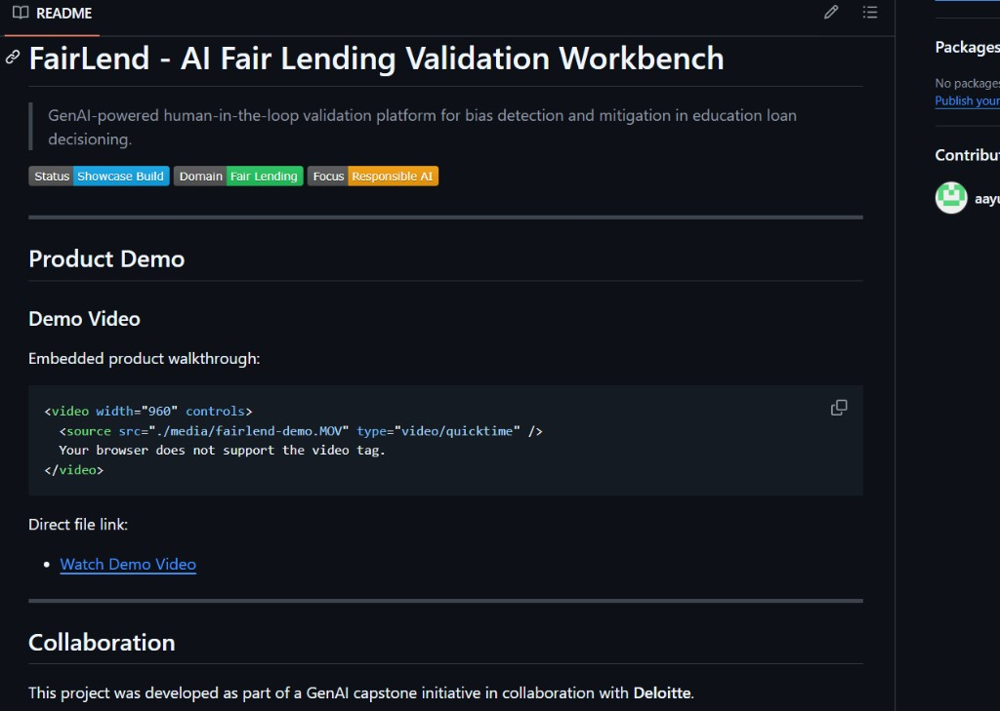
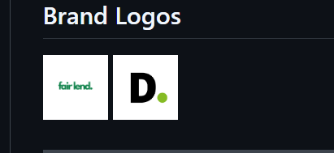

# FairLend - AI Fair Lending Validation Workbench

> GenAI-powered human-in-the-loop validation platform for bias detection and mitigation in education loan decisioning.

---

## Collaboration

This project was developed as part of a GenAI capstone initiative in collaboration with **Deloitte**.

  
  

---

## Product Demo

Embedded product walkthrough:

<video width="100%" controls>
  <source src="./media/fairlend-demo.MOV" type="video/quicktime" />
  Your browser does not support the video tag.
</video>

Direct link (recommended fallback):

- [Watch Demo Video](./media/fairlend-demo.MOV)

---

## Product Snapshots

### Dashboard Overview

### Workflow Summary

### Additional Showcase Images

---

## Product Overview

`FairLend` is a validation and audit workbench designed to help teams evaluate fairness risks in AI-assisted education loan decisions before production rollout.

It combines:

- Large-scale synthetic profile generation
- Dual-model scoring simulation (baseline vs biased behavior)
- Fairness metric computation across protected and risk-relevant dimensions
- Human expert feedback capture and review
- Iterative mitigation workflow with before/after comparisons

The goal is to make AI model validation **transparent, auditable, and actionable** for risk, compliance, and model governance teams.

---

## Key Capabilities

### 1) Synthetic Testing at Scale
- Generates diverse synthetic applicant profiles for stress-testing
- Covers edge cases and under-represented segments
- Enables robust scenario analysis without exposing production PII

### 2) Bias Detection & Quantification
- Tracks approval parity and decision disparity indicators
- Highlights segment-level gaps in interest and collateral outcomes
- Surfaces high-severity findings for analyst review

### 3) Human-in-the-Loop Validation
- Analysts review flagged findings
- Domain experts submit severity, root-cause, and mitigation guidance
- Feedback is structured for governance traceability

### 4) Mitigation Lifecycle
- Applies iterative mitigation strategies
- Re-runs evaluation and compares fairness outcomes
- Documents measurable fairness improvement

---

## System Architecture

See the complete architecture diagram and component responsibilities in:

- [SYSTEM_ARCHITECTURE.md](./SYSTEM_ARCHITECTURE.md)

---

### Screenshots

- Dashboard: `media/dashboard-overview.png`
- Workflow: `media/workflow-cycle.png`
- README preview: `media/readme-preview.png`
- Logos preview: `media/logos-preview.png`

---

## Repository Scope (Public Showcase)

This public repository intentionally includes:

- Product vision and problem framing
- Feature overview and architecture
- Demo media and high-level workflow explanation

This public repository intentionally excludes:

- Source code and implementation details
- Proprietary scoring logic and algorithm internals
- Training/evaluation pipelines and internal prompts
- Deployment scripts, credentials, and private configs

---

## Business Impact

FairLend demonstrates how responsible AI controls can be operationalized for lending:

- Improves model governance confidence before launch
- Reduces regulatory and reputational risk
- Shortens fairness audit cycles through automation + expert review
- Provides clear evidence artifacts for compliance discussions

---

## Contact

For collaboration, demos, or case-study discussions:

- Name: `Your Name`
- Email: `your.email@example.com`
- LinkedIn: `https://linkedin.com/in/your-profile`

