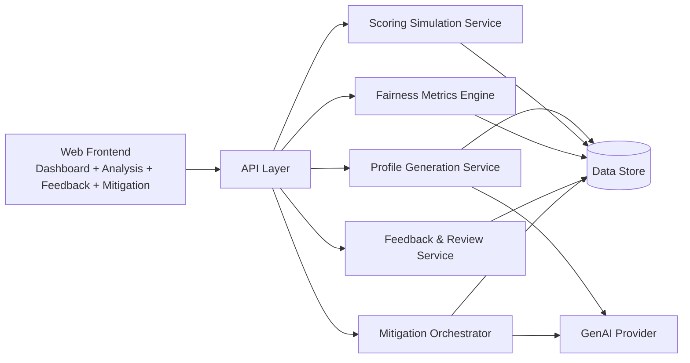

# System Architecture - FairLend

## High-Level View

## Component Responsibilities

### Frontend Layer
- Provides role-based analyst workflow
- Displays KPI cards, trend visuals, and finding tables
- Supports feedback submission and mitigation comparison views

### API Layer
- Exposes endpoints for generation, scoring, metrics, and feedback workflows
- Handles input validation and request orchestration
- Enforces security controls and access boundaries

### Profile Generation Service
- Creates synthetic applicant datasets for controlled evaluation
- Ensures diversity coverage and edge-case stress testing

### Scoring Simulation Service
- Runs comparative scoring scenarios
- Produces outputs used for fairness and disparity analysis

### Fairness Metrics Engine
- Computes parity and disparity indicators
- Produces model-level and segment-level fairness summaries

### Feedback & Review Service
- Captures expert review artifacts
- Stores severity ratings, rationale, and mitigation suggestions

### Mitigation Orchestrator
- Applies iterative mitigation strategies
- Re-evaluates outcomes and generates before/after comparisons

### Data Store
- Persists profiles, run metadata, findings, and feedback artifacts
- Supports traceability across evaluation cycles

---

## Security & Governance Posture (Showcase Summary)

- Synthetic data usage reduces direct exposure to production PII
- API inputs validated before processing
- Access controls and audit logs for governance workflows
- Secrets and operational configs are excluded from this public repository

